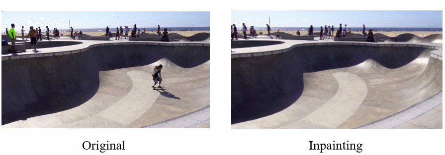

# Video-Object-Removal

只要给物体画上一个方框，就可以在视频中去除这个物体并修复视频

## 使用步骤

+ 安装依赖

```shell
cd video-object-removal
cd masking
bash make.sh
cd inpainting
bash install.sh
```

+ 下载预训练模型，放在 `pretrained_models/`文件夹中

  1. 视觉目标跟踪和视频目标分割基于 [SiamMask](https://github.com/foolwood/SiamMask) 

  2. 视频修复分别使用 [Deep-Flow-Guided-Video-Inpainting](https://github.com/nbei/Deep-Flow-Guided-Video-Inpainting) 或 [STTN](https://github.com/researchmm/STTN) 实现

​	预训练模型请参考以上项目

+ 运行

```bash
python main.py --src demo.mp4 [--flow]
```

​	如果使用第一种方法修复视频，请加上 `--flow` 命令

## 效果展示

+ 画方框


+ 目标将被去除，修复好的视频保存在 `results` 文件夹中


